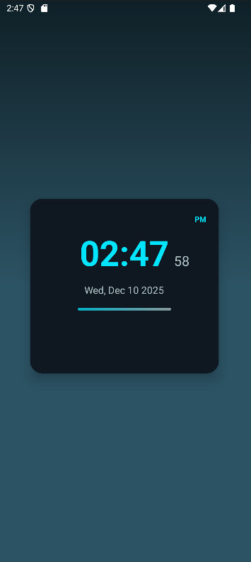

# 23012531079_mad_assignment_app
📱 Premium Digital Clock — Android App

A beautifully designed digital clock app built with Kotlin, featuring a premium UI, smooth animations, and a customizable home screen widget.

✨ Features
🕒 In-App Digital Clock

Live time with seconds

AM/PM indicator

Automatic 12h / 24h support

Full date display (e.g., Wed, Apr 23 2025)

Smooth animations (pulse bar)

Premium card UI with gradient background

Custom monospaced font (Roboto Mono or digital style)

🧩 Home Screen Widget

Clean premium design

Shows:

Time

AM/PM

Date

Updates every minute (Android restriction)

Tapping the widget opens the app

🚀 Technologies Used

Kotlin

Android Studio

AndroidX

AppWidgetProvider

CardView

ObjectAnimator

Material Components

📂 Project Structure
app/
├── java/com.example.premiumclock/
│     ├── MainActivity.kt
│     ├── ClockWidget.kt
│
├── res/
│     ├── layout/activity_main.xml
│     ├── layout/widget_clock.xml
│     ├── drawable/bg_gradient.xml
│     ├── drawable/card_background.xml
│     ├── drawable/pulse_gradient.xml
│     ├── font/roboto_mono.ttf
│     ├── xml/clock_appwidget_info.xml
│
└── AndroidManifest.xml

🛠 How It Works
⏱ In-App Second Updates

The clock updates precisely every second using a Handler:

val delay = 1000L - (now.time % 1000L)
handler.postDelayed(this, delay)

This ensures the UI updates exactly on the second.

📟 Widget Updates

Android does not allow per-second widget updates.
The widget updates every 60 seconds using:

updatePeriodMillis="60000"

System broadcasts:

APPWIDGET_UPDATE

TIMEZONE_CHANGED

TIME_SET

Widget UI is updated through RemoteViews.

📥 Installation

Clone or download this repository

Open the project in Android Studio

Run the app on a device/emulator

Add the widget from the home screen (hold → Widgets → “Premium Digital Clock”)

🖼 Screenshots

(Add your screenshots here when ready. I can format them for you.)

📌 Future Enhancements

Planned or possible improvements:

Multiple themes (Neon, AMOLED, Minimal)

Flip-clock animation

Weather display

Larger widget sizes

Custom font selection

Lock-screen widget (Android 14+)

📄 License

This project is licensed under the MIT License.
You may modify, distribute, and use it freely.

💬 Feedback / Contributions

Feel free to submit issues, feature requests, or pull requests!

If you want, I can also:

Generate a GitHub-badge version

Add screenshots

Make it a professional open-source README with icons and shields

Export as PDF or DOCX

Just tell me “Make an advanced GitHub README” or send your screenshots.
